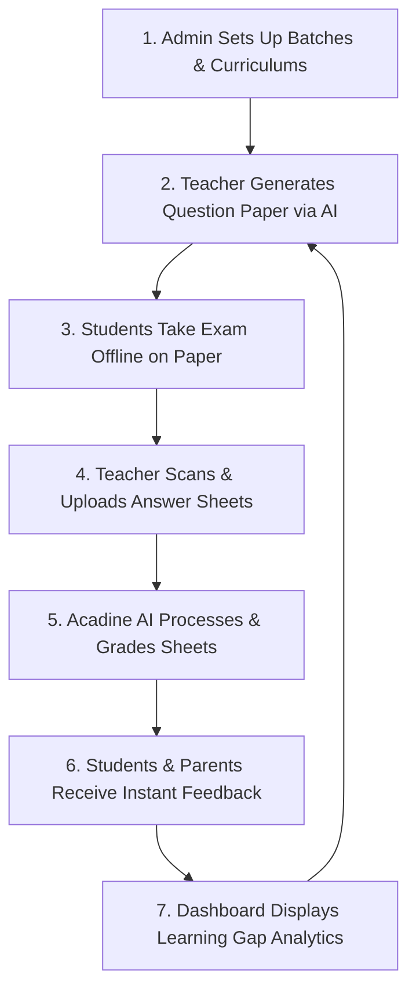

# Acadine.ai: Deep Dive Research & Analysis

Acadine.ai is a modern, AI-driven education management platform and "operating system" designed to streamline academic and administrative operations for educational institutions, including schools, colleges, coaching classes, and test preparation centers. 

---

## 1. Overview of Acadine.ai

* **What it is:** An all-in-one educational operating system that automates core manual academic workloads like exam evaluation, paper generation, and student performance tracking.
* **Founded:** 2025
* **Founders:** Chinmay Anand and Ashish Mandal
* **Headquarters:** Indore, India
* **Access:** Available via a web portal for administrators and desktop users, and as mobile applications on both the **Google Play Store** and **Apple Store** for teachers, students, and parents.

---

## 2. Core Features & Solutions

Acadine.ai segments its capabilities into specialized solutions for different institutional stakeholders:

```
                  ┌───────────────────────────────┐
                  │          Acadine.ai           │
                  └──────────────┬────────────────┘
         ┌───────────────────────┼───────────────────────┐
         ▼                       ▼                       ▼
┌──────────────────┐   ┌──────────────────┐   ┌──────────────────┐
│   For Teachers   │   │ For Admin/Owners │   │   For Students   │
├──────────────────┤   ├──────────────────┤   ├──────────────────┤
│ • AI Grading     │   │ • Multi-center   │   │ • Instant Grades │
│ • Paper Gen (10m)│   │ • Scheduling     │   │ • Performance    │
│ • Learning Gaps  │   │ • Course Sync    │   │ • Rubric Feedback│
└──────────────────┘   └──────────────────┘   └──────────────────┘
```

### A. Automated Handwritten Sheet Evaluation
The flagship feature of Acadine.ai is its ability to grade handwritten answer sheets.
* **Rubric-Based AI Grading:** Teachers upload scanned copies of handwritten student answer sheets, and the AI evaluates them using pre-defined rubrics.
* **High Accuracy:** The platform claims to evaluate answers with teacher-level precision, maintaining a maximum variation of **only 1% to 3%** in total marks compared to human teachers.
* **Fast Turnaround:** It processes and returns evaluated sheets with detailed feedback within **24 hours**.

### B. AI-Powered Question Paper Generation
* **Rapid Generation:** Teachers can create syllabus-compliant question papers in roughly **10 minutes**.
* **Granular Customization:** Allows configuring difficulty levels (basic, intermediate, advanced), distribution of marks, chapter weightage, and question formats (MCQs, short answer, long answer).
* **Curriculum Alignment:** Supports alignment with standardized boards (like CBSE, IGCSE) and custom curriculum structures.

### C. Multi-Level Analytics & Dashboards
Acadine.ai tracks performance across several layers of the organization:
* **Student Level:** Highlights individual strengths, weaknesses, and subject-specific learning gaps.
* **Batch & Center Level:** Allows coaching centers and schools to compare batch performances and center-wise statistics.
* **Topic & Chapter Level:** Identifies which specific topics need revision based on aggregated class scores.
* **Exam Outcomes Prediction:** Leverages historical score trends to predict student performance in final exams.

### D. Centralized Institute Management
* **Multi-Center Control:** Administrators can manage franchises, multiple branches, and campuses from a single platform.
* **Academic Planning:** Built-in calendars for scheduling lectures, mock exams, and assigning teachers.
* **Targeted Communication:** Broadcast announcements, send automated notifications (via SMS, app notifications, or WhatsApp) to parents and students regarding attendance and grades.

---

## 3. How Acadine.ai Works

Here is a step-by-step walk-through of the academic loop within Acadine.ai:



1. **Setup:** The institute administrator registers campuses, classes, batches, subjects, and student enrollments.
2. **Assessment Design:** The teacher utilizes the AI generator to assemble a quiz or test.
3. **Execution:** Students sit for the exam (often offline, using traditional pen-and-paper formats).
4. **Digitization:** Once completed, the teacher uses a scanning app or the Acadine mobile app to capture photos of the answer papers.
5. **AI Evaluation:** The scanned sheets are uploaded to Acadine's cloud servers. The system applies OCR/Computer Vision to transcribe handwritten text and uses an AI model configured with the question paper's marking scheme to evaluate the answers.
6. **Delivery & Feedback:** Corrected sheets are populated with question-by-question comments. Students and parents view the graded copy on their mobile application.
7. **Refinement:** The analytics dashboard highlights which chapters had the lowest average score, prompting the teacher to schedule remedial classes for those topics.

---

## 4. Underlying Technology Stack (How It Works Technically)

While the proprietary internals are private, educational platforms like Acadine.ai leverage a standardized state-of-the-art AI pipeline:

### A. Intelligent Document Processing (IDP)
* **Handwriting OCR (Optical Character Recognition):** Utilizes specialized deep learning models (such as Vision-Language Models like GPT-4o, Gemini 2.0, or proprietary CRNN models) to read varied handwriting styles, symbols, and mathematical notation.
* **Layout Parsing:** Separates the page into margins, question headers, student answers, and pre-existing teacher scribbles.

### B. LLM Rubric Evaluation
* **Prompt Engineering / Fine-Tuning:** The digitized text is paired with the question's model answer and marking scheme (rubric). A Large Language Model (LLM) assesses the semantic completeness of the student's answer, awards marks accordingly, and generates constructive feedback.
* **Evaluation Consistency:** Ensures that identical answers receive identical marks, eliminating the subjective bias or fatigue of human grading.

### C. Data Warehousing & Predictive Analytics
* **Relational/NoSQL Database:** Stores structured student data, timetables, and generation configs.
* **Analytics Engine:** Processes grading metrics to calculate statistical metrics (mean, median, standard deviation) and outputs predictive trends of learning outcomes.

---

> [!NOTE]
> **Important Distinction:** Do not confuse **Acadine.ai** (founded in 2025 in India, focusing on EdTech SaaS) with **Acadine Technologies** (founded in 2015 in Hong Kong, which was a mobile operating system startup for IoT devices and developed the H5OS project). They are completely unrelated entities.
